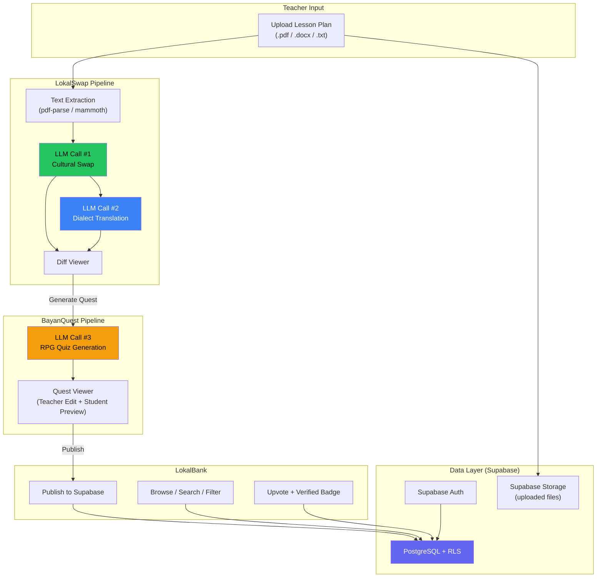

# LokalSwap Platform — Hackathon PRD (v3 — Full Scope)

> **Hackathon: 24 hours. Three features. Zero excuses.**
> LokalSwap (✅ working) → BayanQuest → LokalBank

---

## Elevator Pitch

**LokalSwap is a 3-in-1 platform that lets Filipino teachers upload lesson plans, contextualize them for their region, turn them into RPG-style student quizzes, and share them with a teacher community** — making education locally resonant, engaging, and collaborative. Subway becomes tricycle. Walmart becomes Naga People's Mall. And the student's seatwork becomes an adventure with Mang Cardo at the port.

---

## The "Wow" Demo Flow (Judge Script)

**Total demo time: ~3 minutes.** Three acts, three features.

### Act 1: LokalSwap — "The Contextualizer" (60s) ✅ DONE

| Step | What the Judge Sees | Time |
|------|---------------------|------|
| **1.1 Upload** | Teacher drags a Grade 3 math lesson plan (.pdf) into the upload zone. Text preview appears. | 8s |
| **1.2 Configure** | Selects **"Bicol / Naga City"** + **"Central Bikol"** | 5s |
| **1.3 Generate** | Clicks **"LokalSwap It!"** — spinner for ~3s | 5s |
| **1.4 Diff Viewer** | Side-by-side panel: `subway` → `tricycle`, `Walmart` → `Naga People's Mall`, `$2` → `₱20`. **Green highlights** on all swaps. | 15s |
| **1.5 Translation** | Below the diff: Central Bikol translation with "✨ AI-translated" badge | 10s |
| **1.6 Edit** | Teacher clicks a green span, overrides one swap | 7s |
| **1.7 Transition** | *"Now let's turn this into a student activity..."* → clicks **"Generate Student Quest"** | 10s |

---

### Act 2: BayanQuest — "The Game Maker" (60s)

| Step | What the Judge Sees | Time |
|------|---------------------|------|
| **2.1 Quest Config** | A modal appears with options: Number of questions (5), Difficulty (Grade 3), Quest theme (auto-suggested: "Mang Cardo's Fish Market Adventure") | 8s |
| **2.2 Generate** | Clicks **"Generate Quest!"** — spinner with pixel-art loading animation | 5s |
| **2.3 Quest Preview** | An interactive card-based quiz appears. Each question is framed as an RPG scenario: *"Mang Cardo caught 12 bangus at the Naga port. He sold 5 to Aling Rosa. How many bangus does he have left?"* — with 4 multiple-choice answers styled as RPG dialogue options | 20s |
| **2.4 Teacher Edit** | Teacher clicks to edit a question, changes "bangus" to "tilapia" | 8s |
| **2.5 Student View** | Clicks **"Preview as Student"** — full-screen RPG-style quiz interface with character art, progress bar, and immediate feedback ("Tama! +10 XP") | 12s |
| **2.6 Transition** | *"Now let's share this with other teachers in Bicol..."* → clicks **"Publish to LokalBank"** | 7s |

---

### Act 3: LokalBank — "The Community Vault" (60s)

| Step | What the Judge Sees | Time |
|------|---------------------|------|
| **3.1 Publish** | A publish modal pre-fills metadata: Region (Bicol), Grade (3), Subject (Math), MATATAG Competency (auto-tagged). Teacher adds a title and clicks **"Publish"** | 12s |
| **3.2 Browse** | Navigate to LokalBank page. A searchable grid of teacher-published lesson plans appears, filtered by "Bicol, Grade 3, Math". Each card shows title, author, region, upvote count | 15s |
| **3.3 Preview** | Click a card → full preview of the contextualized lesson + BayanQuest quiz | 10s |
| **3.4 Upvote** | Teacher upvotes the lesson. A "Verified Exemplar ⭐" badge appears on a high-rated plan | 8s |
| **3.5 Clone** | Clicks **"Clone to My Lessons"** — the lesson is copied to their workspace for further customization | 8s |
| **3.6 Close** | *"This is LokalSwap — from upload to community, in 3 clicks."* | 7s |

> [!TIP]
> **Three demo beats:** Act 1 = green highlights appear. Act 2 = RPG quiz renders. Act 3 = a lesson gets the ⭐ Verified Exemplar badge.

---

## User Stories

### Feature 1: LokalSwap (✅ Done)

#### US-1: Lesson Plan Upload & Cultural Contextualization
> **As a** Grade 3 teacher in Naga City,  
> **I want to** upload my lesson plan file and select my region,  
> **so that** the scenarios, word problems, and examples are automatically contextualized with places, items, and settings my students actually recognize.

#### US-2: Visual Diff Review
> **As a** teacher reviewing LokalSwap output,  
> **I want to** see a side-by-side view with green highlights on every changed item,  
> **so that** I can instantly verify and override any cultural swap before using it.

#### US-3: Dialect Translation
> **As a** teacher using MTB-MLE materials,  
> **I want** the localized text translated into my students' mother tongue as a clearly-labeled separate step,  
> **so that** I can use the cultural swap even if the translation needs manual correction.

---

### Feature 2: BayanQuest

#### US-4: RPG Quiz Generation from Localized Content
> **As a** teacher who just localized a lesson plan,  
> **I want to** click one button and generate an RPG-narrative quiz based on my localized lesson,  
> **so that** my students engage with seatwork through locally-themed adventures instead of dry worksheets.

**Acceptance Criteria:**
- [ ] "Generate Student Quest" button appears after a successful LokalSwap output
- [ ] Teacher can configure: number of questions (3-10), difficulty level, quest theme
- [ ] LLM generates questions using localized entities and RPG narrative framing
- [ ] Each question has 4 multiple-choice answers with one correct answer
- [ ] Questions are structured JSON for consistent rendering
- [ ] Teacher can edit any question/answer before publishing

#### US-5: Student Quiz Preview
> **As a** teacher,  
> **I want to** preview the quiz as my student would see it,  
> **so that** I can verify the experience is engaging and age-appropriate before assigning it.

**Acceptance Criteria:**
- [ ] Full-screen "Student View" mode with RPG-style UI (character art, progress bar, XP)
- [ ] Immediate feedback on answer selection ("Tama! +10 XP" / "Subukan ulit!")
- [ ] Score summary at the end
- [ ] Works on mobile viewports (students may use phones)

---

### Feature 3: LokalBank

#### US-6: Publish to Community Repository
> **As a** teacher who created a localized lesson + BayanQuest quiz,  
> **I want to** publish it to a shared regional repository in one click,  
> **so that** other teachers in my area don't have to start from scratch.

**Acceptance Criteria:**
- [ ] Publish modal pre-fills metadata (region, grade, subject) from LokalSwap context
- [ ] Teacher can add: title, description, MATATAG competency tag
- [ ] Published content is associated with the teacher's authenticated profile
- [ ] Published content is immediately visible in the LokalBank browse view
- [ ] Content includes both the localized lesson plan and the generated quiz

#### US-7: Browse, Upvote & Clone
> **As a** teacher browsing LokalBank,  
> **I want to** filter by region/grade/subject, upvote quality lessons, and clone them for my own use,  
> **so that** I can leverage the community's best work.

**Acceptance Criteria:**
- [ ] Searchable, filterable grid (region, grade level, subject, MATATAG competency)
- [ ] Each card shows: title, author name, region, upvote count, "Verified Exemplar" badge if applicable
- [ ] One-click upvote (one per user per lesson, togglable)
- [ ] "Clone to My Lessons" copies content to the user's workspace
- [ ] Lessons with ≥ 10 upvotes auto-earn "Verified Exemplar ⭐" badge
- [ ] Preview modal shows full lesson + quiz without cloning

---

## Technical Architecture

### System Overview



---

### Database Schema (Supabase PostgreSQL)

> [!IMPORTANT]
> All tables use **Row Level Security (RLS)**. The existing `profiles` table is already built. The schema below adds 4 new tables.

#### Existing: `profiles` (✅ Done)

Already in [0001_profiles.sql](file:///c:/Users/Daniel%20Aldrin/.vscode/HACKATHON/hackercup/supabase/migrations/0001_profiles.sql) — `id`, `username`, `display_name`, `avatar_url`, `bio`.

---

#### New: `lessons` — Stores localized lesson plans

```sql
create table if not exists public.lessons (
  id            uuid        primary key default gen_random_uuid(),
  author_id     uuid        not null references public.profiles(id) on delete cascade,
  title         text        not null,
  description   text        null,
  
  -- LokalSwap data
  original_text   text      not null,
  localized_text  text      not null,
  changes_json    jsonb     not null default '[]',   -- [{original, replacement, category}]
  translated_text text      null,
  translation_lang text     null,
  
  -- Metadata for filtering
  region        text        not null,                -- e.g. 'bicol_naga'
  grade_level   text        not null,                -- e.g. 'grade_3'
  subject       text        not null,                -- e.g. 'math'
  matatag_comp  text        null,                    -- MATATAG competency tag
  
  -- Publishing
  is_published  boolean     not null default false,
  published_at  timestamptz null,
  upvote_count  integer     not null default 0,
  is_verified   boolean     not null default false,  -- auto: true when upvote_count >= 10
  
  created_at    timestamptz not null default now(),
  updated_at    timestamptz not null default now(),
  
  constraint title_length check (char_length(title) between 3 and 200),
  constraint description_length check (char_length(description) <= 1000),
  constraint original_text_length check (char_length(original_text) <= 50000),
  constraint localized_text_length check (char_length(localized_text) <= 50000)
);

-- RLS
alter table public.lessons enable row level security;

-- Anyone can read published lessons
create policy "Published lessons are viewable by everyone"
  on public.lessons for select
  using (is_published = true OR auth.uid() = author_id);

-- Users can only insert their own lessons
create policy "Users can insert their own lessons"
  on public.lessons for insert
  with check (auth.uid() = author_id);

-- Users can only update their own lessons
create policy "Users can update their own lessons"
  on public.lessons for update
  using (auth.uid() = author_id)
  with check (auth.uid() = author_id);

-- Users can only delete their own lessons
create policy "Users can delete their own lessons"
  on public.lessons for delete
  using (auth.uid() = author_id);

-- Indexes
create index if not exists lessons_author_idx on public.lessons (author_id);
create index if not exists lessons_published_idx on public.lessons (is_published, region, grade_level, subject);
create index if not exists lessons_upvote_idx on public.lessons (upvote_count desc) where is_published = true;
```

---

#### New: `quests` — Stores BayanQuest quizzes (linked to a lesson)

```sql
create table if not exists public.quests (
  id            uuid        primary key default gen_random_uuid(),
  lesson_id     uuid        not null references public.lessons(id) on delete cascade,
  author_id     uuid        not null references public.profiles(id) on delete cascade,
  
  title         text        not null,                -- e.g. "Mang Cardo's Fish Market Adventure"
  theme         text        null,
  difficulty    text        not null default 'grade_3',
  questions     jsonb       not null default '[]',   -- Array of question objects (see schema below)
  question_count integer   not null default 5,
  
  created_at    timestamptz not null default now(),
  updated_at    timestamptz not null default now(),
  
  constraint quest_title_length check (char_length(title) between 3 and 200),
  constraint question_count_range check (question_count between 1 and 20)
);

-- RLS
alter table public.quests enable row level security;

-- Quests inherit visibility from their parent lesson
create policy "Quests viewable if lesson is viewable"
  on public.quests for select
  using (
    auth.uid() = author_id 
    OR exists (
      select 1 from public.lessons 
      where lessons.id = quests.lesson_id 
      and lessons.is_published = true
    )
  );

create policy "Users can insert their own quests"
  on public.quests for insert
  with check (auth.uid() = author_id);

create policy "Users can update their own quests"
  on public.quests for update
  using (auth.uid() = author_id)
  with check (auth.uid() = author_id);

create policy "Users can delete their own quests"
  on public.quests for delete
  using (auth.uid() = author_id);

-- Indexes
create index if not exists quests_lesson_idx on public.quests (lesson_id);
create index if not exists quests_author_idx on public.quests (author_id);
```

**Quest `questions` JSONB Schema:**
```json
[
  {
    "id": "q1",
    "narrative": "Mang Cardo caught 12 bangus at the Naga port. He sold 5 to Aling Rosa.",
    "question": "How many bangus does Mang Cardo have left?",
    "choices": [
      { "id": "a", "text": "7", "isCorrect": true },
      { "id": "b", "text": "17", "isCorrect": false },
      { "id": "c", "text": "5", "isCorrect": false },
      { "id": "d", "text": "12", "isCorrect": false }
    ],
    "explanation": "12 - 5 = 7. Mang Cardo has 7 bangus left.",
    "xpReward": 10
  }
]
```

---

#### New: `upvotes` — One upvote per user per lesson

```sql
create table if not exists public.upvotes (
  id          uuid        primary key default gen_random_uuid(),
  user_id     uuid        not null references public.profiles(id) on delete cascade,
  lesson_id   uuid        not null references public.lessons(id) on delete cascade,
  created_at  timestamptz not null default now(),
  
  -- Prevent duplicate upvotes
  constraint unique_upvote unique (user_id, lesson_id)
);

-- RLS
alter table public.upvotes enable row level security;

-- Anyone can see upvotes (for count display)
create policy "Upvotes are viewable by everyone"
  on public.upvotes for select
  using (true);

-- Users can only insert their own upvotes
create policy "Users can insert their own upvotes"
  on public.upvotes for insert
  with check (auth.uid() = user_id);

-- Users can only delete their own upvotes (un-upvote)
create policy "Users can delete their own upvotes"
  on public.upvotes for delete
  using (auth.uid() = user_id);

-- Index
create index if not exists upvotes_lesson_idx on public.upvotes (lesson_id);

-- Trigger: Auto-update lesson upvote_count and is_verified
create or replace function public.update_lesson_upvote_count()
returns trigger language plpgsql security definer set search_path = '' as $$
begin
  if (TG_OP = 'INSERT') then
    update public.lessons 
    set upvote_count = upvote_count + 1,
        is_verified = (upvote_count + 1 >= 10)
    where id = NEW.lesson_id;
    return NEW;
  elsif (TG_OP = 'DELETE') then
    update public.lessons 
    set upvote_count = greatest(upvote_count - 1, 0),
        is_verified = (greatest(upvote_count - 1, 0) >= 10)
    where id = OLD.lesson_id;
    return OLD;
  end if;
  return null;
end;
$$;

drop trigger if exists on_upvote_change on public.upvotes;
create trigger on_upvote_change
  after insert or delete on public.upvotes
  for each row execute procedure public.update_lesson_upvote_count();
```

---

#### New: `clones` — Track who cloned what (for analytics)

```sql
create table if not exists public.clones (
  id              uuid        primary key default gen_random_uuid(),
  user_id         uuid        not null references public.profiles(id) on delete cascade,
  source_lesson_id uuid       not null references public.lessons(id) on delete cascade,
  cloned_lesson_id uuid       not null references public.lessons(id) on delete cascade,
  created_at      timestamptz not null default now()
);

-- RLS
alter table public.clones enable row level security;

create policy "Users can see their own clones"
  on public.clones for select
  using (auth.uid() = user_id);

create policy "Users can insert their own clones"
  on public.clones for insert
  with check (auth.uid() = user_id);

create index if not exists clones_user_idx on public.clones (user_id);
```

---

### Security Architecture (Fool-Proof)

> [!CAUTION]
> Security is non-negotiable, even in a hackathon. The following measures protect against the most common attack vectors.

#### 1. Authentication & Authorization
- **Supabase Auth** handles all login/signup — no custom auth code
- **Middleware** ([middleware.ts](file:///c:/Users/Daniel%20Aldrin/.vscode/HACKATHON/hackercup/src/middleware.ts)) protects `/dashboard/*` routes and all `/api/*` routes requiring auth
- **RLS on every table** — even if the API is bypassed, Supabase enforces row-level access
- **`auth.uid()` in every policy** — users can never read/write other users' private data

#### 2. Input Validation (Zod on Every Endpoint)

```typescript
// /api/localize — input validation
const LocalizeSchema = z.object({
  text: z.string().min(10).max(50000).trim(),
  region: z.enum(['bicol_naga', 'cebu_city', 'davao_city', 'ilocos_norte', 'ncr_manila']),
  targetLanguage: z.enum(['central_bikol', 'cebuano', 'ilocano', 'hiligaynon', 'waray']),
});

// /api/quest/generate — input validation
const QuestGenerateSchema = z.object({
  lessonId: z.string().uuid(),
  questionCount: z.number().int().min(3).max(10),
  difficulty: z.enum(['grade_1', 'grade_2', 'grade_3', 'grade_4', 'grade_5', 'grade_6']),
  theme: z.string().max(200).optional(),
});

// /api/bank/publish — input validation
const PublishSchema = z.object({
  lessonId: z.string().uuid(),
  title: z.string().min(3).max(200).trim(),
  description: z.string().max(1000).trim().optional(),
  gradeLevel: z.enum(['grade_1', 'grade_2', 'grade_3', 'grade_4', 'grade_5', 'grade_6']),
  subject: z.enum(['math', 'science', 'english', 'filipino', 'ap', 'mapeh']),
  matagComp: z.string().max(200).trim().optional(),
});
```

#### 3. File Upload Security

```typescript
// Allowed MIME types — reject everything else
const ALLOWED_MIME_TYPES = [
  'text/plain',
  'application/pdf',
  'application/vnd.openxmlformats-officedocument.wordprocessingml.document',
];

// Hard limits
const MAX_FILE_SIZE = 5 * 1024 * 1024;  // 5MB
const MAX_TEXT_LENGTH = 50_000;           // 50K chars after extraction

// Validation pipeline
function validateUpload(file: File): void {
  if (!ALLOWED_MIME_TYPES.includes(file.type)) {
    throw new Error('Invalid file type. Only .txt, .pdf, and .docx are accepted.');
  }
  if (file.size > MAX_FILE_SIZE) {
    throw new Error('File too large. Maximum size is 5MB.');
  }
}
```

#### 4. Rate Limiting (Simple In-Memory for Hackathon)

```typescript
// Simple per-user rate limiter for LLM endpoints
const rateLimiter = new Map<string, { count: number; resetAt: number }>();

function checkRateLimit(userId: string, maxRequests = 20, windowMs = 60_000): boolean {
  const now = Date.now();
  const entry = rateLimiter.get(userId);
  
  if (!entry || now > entry.resetAt) {
    rateLimiter.set(userId, { count: 1, resetAt: now + windowMs });
    return true;
  }
  
  if (entry.count >= maxRequests) return false;
  entry.count++;
  return true;
}
```

#### 5. LLM Prompt Injection Defense

```typescript
// Sanitize user input before sending to LLM
function sanitizeForLLM(text: string): string {
  return text
    .replace(/```/g, '')              // Remove code fences
    .replace(/\b(ignore|forget|disregard|override)\b.*?(instructions|rules|prompt)/gi, '') 
    .slice(0, 50_000)                 // Hard length cap
    .trim();
}
```

> [!IMPORTANT]
> The LLM system prompt is never exposed to the client. All LLM calls happen server-side via API routes. User input is always the `user` role, never injected into the `system` prompt string.

#### 6. Content Moderation on Publish

```typescript
// Before publishing to LokalBank, basic content check
function validateContent(text: string): { safe: boolean; reason?: string } {
  const MAX_PUBLISH_LENGTH = 50_000;
  if (text.length > MAX_PUBLISH_LENGTH) {
    return { safe: false, reason: 'Content exceeds maximum length.' };
  }
  // LLM-based content check (optional, if time allows)
  // For hackathon: rely on teacher identity (authenticated users only)
  return { safe: true };
}
```

#### Security Summary

| Vector | Mitigation | Layer |
|--------|-----------|-------|
| **Unauthorized access** | Supabase Auth + RLS on every table | DB + Middleware |
| **Data tampering** | `auth.uid()` in all RLS policies — can't write others' rows | DB |
| **Invalid input** | Zod validation on every API endpoint | API |
| **Malicious file upload** | MIME whitelist + 5MB limit + text-only extraction | API |
| **Prompt injection** | Input sanitization + system/user role separation | API |
| **Abuse / spam** | Rate limiting (20 req/min per user on LLM endpoints) | API |
| **Vote manipulation** | `unique (user_id, lesson_id)` constraint on upvotes table | DB |
| **XSS in published content** | React auto-escapes. No `dangerouslySetInnerHTML`. | Frontend |

---

### LLM Pipeline

#### Step 1: Cultural Swap (✅ Done)
See existing LokalSwap pipeline — no changes needed.

#### Step 2: Dialect Translation (✅ Done)
See existing LokalSwap pipeline — no changes needed.

#### Step 3: BayanQuest RPG Quiz Generation (NEW)

**API Endpoint:** `POST /api/quest/generate`

**LLM Prompt (System):**
```
You are BayanQuest, an RPG quiz generator for Filipino students.

Your job: Take a localized lesson plan and generate an interactive RPG-narrative 
quiz where each question is framed as a local adventure scenario.

RULES:
1. Use the localized entities from the lesson plan (local places, people, items).
2. Frame each question as a mini-story with local characters (e.g., Mang Cardo, 
   Aling Rosa, Kuya Jun) doing locally relevant activities.
3. Each question must have exactly 4 choices with exactly 1 correct answer.
4. Include a brief explanation for the correct answer.
5. Questions must match the specified grade level and difficulty.
6. Keep language in Filipino/English (the teacher will handle dialect if needed).
7. Award XP points: 10 for easy, 15 for medium, 20 for hard questions.

Respond in this exact JSON format:
{
  "quest_title": "Mang Cardo's Fish Market Adventure",
  "questions": [
    {
      "id": "q1",
      "narrative": "Mang Cardo caught 12 bangus at the Naga port...",
      "question": "How many bangus does Mang Cardo have left?",
      "choices": [
        { "id": "a", "text": "7", "isCorrect": true },
        { "id": "b", "text": "17", "isCorrect": false },
        { "id": "c", "text": "5", "isCorrect": false },
        { "id": "d", "text": "12", "isCorrect": false }
      ],
      "explanation": "12 - 5 = 7.",
      "xpReward": 10
    }
  ]
}
```

**LLM Prompt (User):**
```
Localized Lesson Plan: {{localized_text}}
Region: {{region}}
Difficulty: {{difficulty}}
Number of Questions: {{question_count}}
Quest Theme (optional): {{theme}}
```

**Model:** Gemini 2.0 Flash

---

### API Route Map (Complete)

```
# LokalSwap (✅ Done)
POST /api/extract              → File upload → text extraction
POST /api/localize             → Cultural swap + translation

# BayanQuest (NEW)
POST /api/quest/generate       → LLM generates RPG quiz from localized content
POST /api/quest/save           → Save quest to DB (requires auth)

# LokalBank (NEW)
POST /api/bank/publish         → Publish lesson + quest to community (requires auth)
GET  /api/bank/browse          → Filterable list of published lessons
GET  /api/bank/lesson/[id]     → Full lesson + quest detail
POST /api/bank/upvote          → Toggle upvote on a lesson (requires auth)
POST /api/bank/clone           → Clone a lesson to user's workspace (requires auth)
```

**Auth Requirement:** All endpoints except `GET /api/bank/browse` and `GET /api/bank/lesson/[id]` require authentication via Supabase session.

---

### Frontend Architecture

#### Page Structure

```
/                           → Landing page (hero + feature overview)
/dashboard                  → Teacher workspace (requires auth)
/dashboard/swap             → LokalSwap tool (upload + diff viewer)  ✅
/dashboard/swap/[id]/quest  → BayanQuest generator (post-swap)
/dashboard/lessons          → My saved lessons & quests
/bank                       → LokalBank browse/search (public)
/bank/[id]                  → Lesson detail + preview (public)
/auth/login                 → Login page
/auth/signup                → Signup page
```

#### Component Trees

**BayanQuest Components:**
```
<QuestGenerator>
  ├─ <QuestConfigModal>        ← question count, difficulty, theme
  ├─ <QuestPreview>            ← Teacher view of generated quiz
  │    └─ <QuestionCard>       ← Editable question with RPG narrative
  │         ├─ <NarrativeText> ← Story framing
  │         ├─ <ChoiceList>    ← 4 styled choice buttons
  │         └─ <EditButton>    ← Click to edit question/answers
  └─ <StudentPreview>          ← Full-screen RPG quiz experience
       ├─ <QuestHeader>        ← Quest title + progress bar + XP counter
       ├─ <QuestionScene>      ← Animated question display
       ├─ <ChoiceButtons>      ← Interactive answer buttons
       └─ <FeedbackOverlay>    ← "Tama! +10 XP" or "Subukan ulit!"
```

**LokalBank Components:**
```
<BankBrowse>
  ├─ <SearchBar>               ← Text search
  ├─ <FilterPanel>             ← Region, Grade, Subject, Competency
  ├─ <LessonGrid>              ← Responsive card grid
  │    └─ <LessonCard>         ← Title, author, region, upvotes, badge
  │         ├─ <UpvoteButton>  ← Heart icon + count
  │         └─ <VerifiedBadge> ← "⭐ Verified Exemplar" (if upvotes >= 10)
  └─ <LessonDetailModal>       ← Full preview + Clone button
       ├─ <LessonPreview>
       ├─ <QuestPreview>
       └─ <CloneButton>

<PublishModal>
  ├─ <MetadataForm>            ← Title, description, grade, subject, competency
  └─ <PublishButton>           ← With confirmation dialog
```

---

### Tech Stack (Revised)

| Layer | Choice | Rationale |
|-------|--------|-----------|
| **Framework** | Next.js 16 (existing) | Already scaffolded, API routes built-in |
| **Auth** | Supabase Auth (existing) | Already configured with middleware + RLS |
| **Database** | Supabase PostgreSQL (existing) | RLS, triggers, JSONB for quest data |
| **LLM** | Gemini 2.0 Flash | Fast, cheap, good at structured JSON |
| **File Parsing** | `pdf-parse` + `mammoth` | Lightweight text extraction |
| **Validation** | Zod (existing) | Already in package.json |
| **State** | Zustand (existing) | Already in package.json, use for quest/bank state |
| **Styling** | Vanilla CSS | No new deps needed |
| **Deployment** | Vercel | One-click deploy |

---

## Build Priority & Timeline (24 Hours)

> [!WARNING]
> LokalSwap is already working. We have the full 24 hours for BayanQuest + LokalBank + polish.

### Workstream A: BayanQuest (Lead Dev)

| Block | Task | Time | Priority |
|-------|------|------|----------|
| **T+0h** | Quest generation LLM prompt + `/api/quest/generate` route | 2h | 🔴 P0 |
| **T+2h** | `QuestPreview` component (teacher view, editable question cards) | 3h | 🔴 P0 |
| **T+5h** | `StudentPreview` component (RPG-style full-screen quiz) | 3h | 🔴 P0 |
| **T+8h** | Wire "Generate Student Quest" button from LokalSwap → BayanQuest | 1h | 🔴 P0 |
| **T+9h** | Save quest to DB (`/api/quest/save` + `quests` table migration) | 1.5h | 🔴 P0 |
| **T+10.5h** | UI polish: RPG animations, XP counter, feedback overlays | 2h | 🟡 P1 |

### Workstream B: LokalBank (Second Dev or Sequential)

| Block | Task | Time | Priority |
|-------|------|------|----------|
| **T+0h** | Database migrations (`lessons`, `quests`, `upvotes`, `clones` tables + RLS) | 2h | 🔴 P0 |
| **T+2h** | `/api/bank/publish` + `PublishModal` component | 2h | 🔴 P0 |
| **T+4h** | `/api/bank/browse` + `BankBrowse` page with filter/search | 3h | 🔴 P0 |
| **T+7h** | `LessonCard` + `UpvoteButton` + `VerifiedBadge` | 2h | 🔴 P0 |
| **T+9h** | `/api/bank/clone` + `CloneButton` + lesson detail preview | 2h | 🔴 P0 |
| **T+11h** | UI polish: card animations, empty states, responsive grid | 1.5h | 🟡 P1 |

### Shared: Integration & Polish

| Block | Task | Time | Priority |
|-------|------|------|----------|
| **T+12h** | End-to-end integration testing (Swap → Quest → Publish → Browse → Clone) | 2h | 🔴 P0 |
| **T+14h** | Security hardening: Zod validation on all routes, rate limiter, file upload checks | 2h | 🔴 P0 |
| **T+16h** | Input sanitization, error boundaries, graceful error messages | 1.5h | 🟡 P1 |
| **T+17.5h** | Landing page hero section + feature overview | 1.5h | 🟡 P1 |
| **T+19h** | Demo rehearsal with full 3-act flow | 2h | 🔴 P0 |
| **T+21h** | Deployment to Vercel + smoke test on live URL | 1.5h | 🔴 P0 |
| **T+22.5h** | Buffer | 1.5h | — |

> [!WARNING]
> **Hard cut line: T+12h.** If at hour 12 either BayanQuest (end-to-end quiz generation) or LokalBank (publish + browse) is not working, drop P1 items and stabilize P0. A working demo of 3 features with rough UI beats 2 polished features.

---

## Out of Scope — Future Roadmap (Pitch Deck Only)

> [!NOTE]
> This is the **only** feature not built in the hackathon. It exists for the "Where does this go?" pitch slide.

### 📋 DepEd MATATAG DLL/WLL Generator (Future)
*Auto-populates DepEd's official Daily Lesson Log and Weekly Learning Log forms with localized content from LokalSwap + BayanQuest, eliminating hours of manual teacher paperwork.*

---

## Success Criteria (Demo Day)

| Criterion | Metric |
|-----------|--------|
| **LokalSwap works live** | Upload → Diff → Translation in < 10 seconds |
| **BayanQuest works live** | Generate Quest → RPG preview in < 8 seconds |
| **LokalBank works live** | Publish → Browse → Clone → Upvote flow completes |
| **Cultural accuracy** | At least 4/5 entity swaps are contextually correct |
| **RPG engagement** | Quiz questions use local characters and scenarios |
| **Community proof** | At least 2 lessons visible in LokalBank during demo |
| **Security** | No unauthenticated writes possible. RLS blocks cross-user access |
| **Narrative** | Judges understand the 3-feature story in 3 minutes |

---

## Design Review: Multi-Agent Brainstorming Log (v3)

### Decision Log

| # | Decision | Alternatives | Objections | Resolution |
|---|----------|-------------|------------|------------|
| D1 | Two-step LLM pipeline (Cultural Swap → Translation) | Single prompt | Adds latency | Accuracy > speed. ✅ Kept. |
| D2 | Gemini 2.0 Flash for all 3 LLM calls | Mix models | Complexity | Single model, single API key. ✅ |
| D3 | Supabase for LokalBank (not a separate backend) | Firebase, custom API | Lock-in | Already configured + RLS is perfect for this. ✅ |
| D4 | JSONB for quest `questions` column | Separate `questions` table | Joins are slow for quiz rendering | JSONB is faster for read-heavy quiz display. Queries are on `lessons`, not `questions`. ✅ |
| D5 | DB trigger for auto-updating `upvote_count` | Client-side count | Race conditions | Trigger is atomic and tamper-proof. ✅ |
| D6 | `is_verified` auto-set at 10 upvotes | Manual admin review | Time constraint | Auto-badge for hackathon. Add admin review post-hack. ✅ |
| D7 | Clone = full DB copy (not reference) | Reference/fork model | Storage duplication | Cloned lessons should be independently editable. Copy is correct. ✅ |
| D8 | No real-time features (no WebSockets) | Live upvote counts | Complexity | Static counts are fine for demo. ✅ |
| D9 | Rate limit: 20 req/min per user on LLM endpoints | No rate limit | Abuse | Simple Map-based limiter. Good enough for hackathon. ✅ |

---

### 🔴 Skeptic / Challenger Review (v3)

**Objection S1: BayanQuest LLM may generate pedagogically incorrect questions.**
- *Example: Math question with wrong answer marked as correct.*
- **Resolution:** Teacher-in-the-loop is mandatory. Teacher previews and edits every question before saving/publishing. The UI makes editing frictionless (inline edit on each QuestionCard).

**Objection S2: LokalBank could become a dumping ground of low-quality content.**
- **Resolution:** Multi-layered quality: (1) Only authenticated teachers can publish. (2) Upvote system surfaces quality. (3) "Verified Exemplar" badge at 10 upvotes. (4) Future: Master Teacher review role.

**Objection S3: Clone creates duplicate data — storage concerns.**
- **Resolution:** At hackathon scale, irrelevant. Post-hack: add `forked_from` reference field for deduplication. For now, full copy ensures independence.

**Objection S4: What if the 3-feature demo is too rushed for judges?**
- **Resolution:** Each act is exactly 60 seconds. Practice transitions. The "wow" beat in each act is clear. If time is tight, LokalBank can be shown as a quick scroll-through.

**Objection S5: Quest generation adds a 3rd LLM call — total latency may be too high.**
- **Resolution:** Quest generation is a separate user action ("Generate Student Quest" button), not part of the initial LokalSwap flow. User expects to wait. Show a fun pixel-art loading animation.

---

### 🛡️ Constraint Guardian Review (v3)

**Objection C1: 4 new database tables + RLS policies in a hackathon.**
- **Resolution:** SQL is pre-written in the PRD. Copy-paste into Supabase SQL Editor. Test RLS with 2 test accounts. Total setup time: ~30 minutes.

**Objection C2: Supabase free tier limits (500MB DB, 1GB storage).**
- **Resolution:** At hackathon scale with demo data, we'll use < 1% of limits. Not a concern.

**Objection C3: No pagination on LokalBank browse.**
- **Resolution:** For demo, we'll have < 20 lessons total. Add `LIMIT 50` + cursor pagination post-hack. For now, load all published lessons.

**Objection C4: File uploads stored in Supabase Storage — cost?**
- **Resolution:** We only extract text and discard the file. No persistent file storage needed. Text goes into the `lessons.original_text` column.

**Objection C5: In-memory rate limiter resets on serverless cold start.**
- **Resolution:** Acceptable for hackathon. Vercel functions stay warm during active demo. Post-hack: use Redis or Supabase rate limiting.

---

### 👤 User Advocate Review (v3)

**Objection U1: Teacher flow is 3 features deep — too many clicks?**
- **Resolution:** Flow is progressive, not branching: Upload → Swap → Quest → Publish. Each step flows naturally to the next with a clear CTA button. Teacher can stop at any point.

**Objection U2: "MATATAG Competency" tag — teachers may not know the competency code.**
- **Resolution:** Make it optional. Pre-fill suggestions based on subject and grade level. Add a "Skip" option.

**Objection U3: Student Preview — is it clear this is a preview, not a live quiz?**
- **Resolution:** Add a persistent "👁 Teacher Preview Mode" banner at the top. Exit button returns to teacher view.

**Objection U4: LokalBank — teachers may fear publishing incomplete or imperfect work.**
- **Resolution:** Add reassuring copy: "Share with your fellow teachers! You can update or remove your lesson at any time." Make un-publish easy (toggle switch on My Lessons page).

**Objection U5: What if there are no lessons in LokalBank during demo?**
- **Resolution:** Pre-seed 3-5 demo lessons with different regions/grades before the demo. Include at least one with a "Verified Exemplar" badge.

---

### ⚖️ Integrator / Arbiter Final Ruling (v3)

| Objection | Ruling | Rationale |
|-----------|--------|-----------|
| S1 (Incorrect quiz questions) | ✅ ACCEPTED | Teacher-in-the-loop + editable questions. |
| S2 (Low-quality LokalBank) | ✅ ACCEPTED | Auth + upvotes + verified badge is sufficient. |
| S3 (Clone duplication) | ✅ ACCEPTED | Independence > dedup at this scale. |
| S4 (Demo time pressure) | ✅ ACCEPTED | 60s per act, practiced transitions. |
| S5 (Quest LLM latency) | ✅ ACCEPTED | Separate action, loading animation. |
| C1 (4 tables in hackathon) | ✅ ACCEPTED | Pre-written SQL, 30min setup. |
| C2 (Supabase limits) | ✅ ACCEPTED | Won't hit limits at demo scale. |
| C3 (No pagination) | ✅ ACCEPTED | < 20 lessons, not needed. |
| C4 (File storage) | ✅ ACCEPTED | Extract text, discard file. |
| C5 (Rate limiter resets) | ✅ ACCEPTED | Warm functions during demo. |
| U1 (Too many clicks) | ✅ ACCEPTED | Progressive flow, clear CTAs. |
| U2 (MATATAG code) | ✅ ACCEPTED | Optional field with suggestions. |
| U3 (Preview confusion) | ✅ ACCEPTED | "Teacher Preview Mode" banner. |
| U4 (Publishing fear) | ✅ ACCEPTED | Reassuring copy + easy un-publish. |
| U5 (Empty LokalBank) | ✅ ACCEPTED | Pre-seed 3-5 demo lessons. |

**DISPOSITION: ✅ APPROVED**

> The expanded 3-feature design is ambitious but achievable in 24 hours given that LokalSwap is already working. Security is handled through Supabase RLS (server-enforced, tamper-proof), Zod validation on every endpoint, and teacher-in-the-loop for AI-generated content. The progressive flow (Swap → Quest → Publish) is natural and demo-friendly. All objections are mitigated.

---

*PRD v3 authored via Multi-Agent Brainstorming Skill. All 5 agent roles invoked. Decision Log complete (9 decisions). 15 objections addressed. Design approved by Arbiter.*
